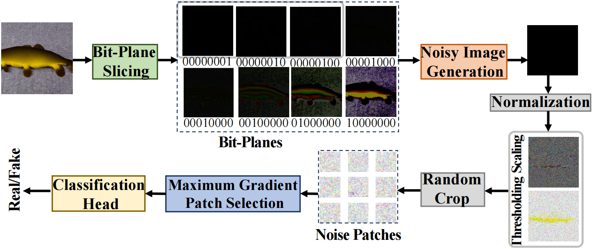

# [LOTA: Bit-Planes Guided AI-Generated Image Detection](https://openaccess.thecvf.com//content/ICCV2025/papers/Wang_LOTA_Bit-Planes_Guided_AI-Generated_Image_Detection_ICCV_2025_paper.pdf), [arXiv](https://arxiv.org/abs/2510.14230)

## 📰 News
- 🚨 **The whole ICCV 2025 papers with Codes are summarized on [ICCV2025_ABSTRACT/](https://hongsong-wang.github.io/ICCV2025_ABSTRACT/)**


<p align="center">
  
<br>
  <b>Figure 1: Comparison of least bit-planes between real images and AI-generated images.</b>
</p>


<p align="center">
  
<br>
  <b>Figure 2: Overview of our method.</b>
</p>

**Novel solution for AI-generated image detection**: We innovatively address AI-generated image detection based on bit-planes, and propose an efficient approach for noisy representation extraction. 

**Efficientpipeline design**: We propose a simple yet effec tive pipeline with three modules: noise generation, patch selection and classification. We design a heuristic strategy called maximum gradient patch selection and introduce two effective classifiers: noise-based classifier and noise guided classifier. Our approach operates at millisecond level, nearly a hundred times faster than current methods. 

**Exceedingly superior performance**: Extensive exper iments demonstrate the effectiveness of LOTA, which achieves 98.9% ACC onGenImage, showing great cross generator generalization capability and outperforming ex isting mainstream methods by more than 11.9%.

## Dataset
We use [GenImage](https://github.com/GenImage-Dataset/GenImage) for training and evaluation, which can be downloaded online. GenImage is composed of 8 subsets (BigGAN, Midjourney, Wukong, Stable_Diffusion_v1.4, Stable_Diffusion_v1.5, ADM, GLIDE, VQDM), each of which contains fake images and real images from ImageNet. Additionally, each subset are invided into training dataset and validating dataset, and we train LOTA on the training dataset of one subset (e.g., Stable_Diffusion_v1.5) and evaluate on the validating dataset of all subsets.

```
@InProceedings{Wang_2025_ICCV,
    author    = {Wang, Hongsong and Cheng, Renxi and Zhang, Yang and Han, Chaolei and Gui, Jie},
    title     = {LOTA: Bit-Planes Guided AI-Generated Image Detection},
    booktitle = {Proceedings of the IEEE/CVF International Conference on Computer Vision (ICCV)},
    month     = {October},
    year      = {2025},
    pages     = {17246-17255}
}

